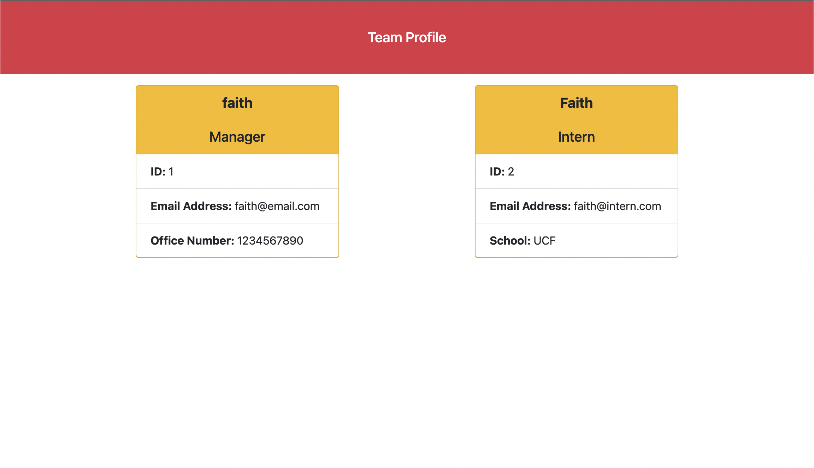

# Team Profile Generator

## Task

First, build a Node.js command-line application that takes in information about employees on a software engineering team, then generates an HTML webpage that displays summaries for each person. 

Then, use unit tests to ensure code is maintainable.


## User Story

```md
AS A manager
I WANT to generate a webpage that displays my team's basic info
SO THAT I have quick access to their emails and GitHub profiles
```


## Visual Demo

The following image shows a mock-up of the generated HTML’s appearance and functionality:




## Video Demo Links
https://watch.screencastify.com/v/VVp6DLsTBjU2prFSuHKt